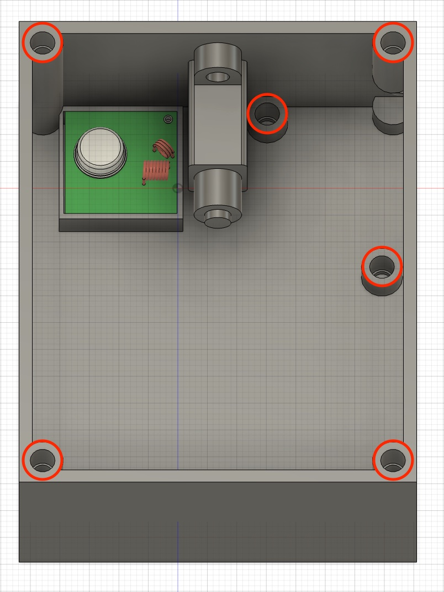
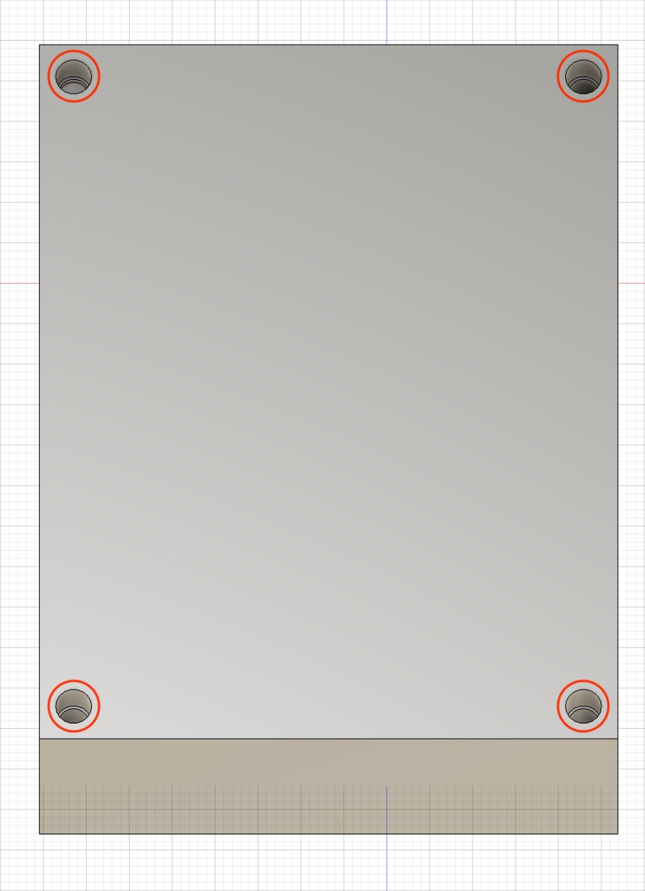
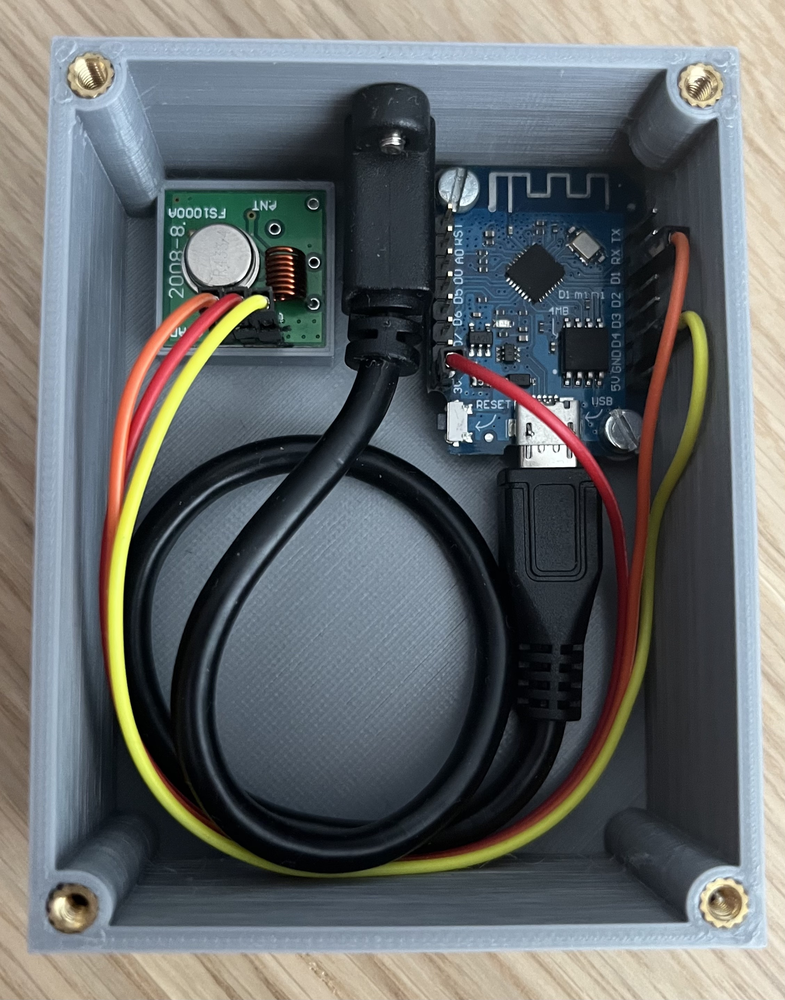

# Somfy Remote

An Arduino Sketch able to emulate a Somfy remote control.
 
If you want to learn more about the Somfy RTS protocol, check out [Pushstack](https://pushstack.wordpress.com/somfy-rts-protocol/).

## Instructions
### Hardware
* You need the following:
[ESP8266 D1 mini V3.0](https://de.aliexpress.com/item/33058233677.html),
[433.92 MHz Transmitter](https://de.aliexpress.com/item/1005004022114649.html),
[433.42 MHz Crystal](https://www.ebay.de/itm/165634756728),
[Micro-USB Extension](https://de.aliexpress.com/item/1005002629990524.html),
M3x6 Screws,
M3 threaded inserts
* 3MFs can be found [here](https://www.printables.com/model/284792-somfy-remote-replacement)
* Replace 433.92 MHz Crystal on Transmitter PCB with 433.42 MHz Crystal
* Drill out holes of the ESP to 3 mm
* Solder Pin Headers to ESP
* Insert threaded inserts

* Assemble everything
* Connect Transmitter with ESP
(DATA - D1,
VCC - 3V3,
GND - GND)

 

### Software
* Download
[ESPAsyncTCP Library (ZIP)](https://github.com/me-no-dev/ESPAsyncTCP/archive/refs/heads/master.zip) and
[ESPAsyncWebServer Library (ZIP)](https://github.com/me-no-dev/ESPAsyncWebServer/archive/refs/heads/master.zip)
* Add https://arduino.esp8266.com/stable/package_esp8266com_index.json to Additional Boards Manager URLs (`Preferences`)
* Install downloaded libraries (`Sketch` → `Include Library` → `Add .ZIP Library`)
* Install software libraries (`Sketch` → `Include Library` → `Manage Libraries`: *AsyncElegantOTA*, *PubSubClient*)
* Install ESP board library (`Tools` → `Board` → `Boards Manager`: *esp8266*)
* Select *LOLIN(WEMOS) D1 R2 & mini* (`Tools` → `Board` → `Boards Manager` → `ESP8266 Boards`)
* Select Serial Port of ESP (`Tools` → `Port`)
 

## How the software works:
What you really want to keep here are the `build_frame` and `send_command` procedures. Input the *remote address* and the *rolling code* value and you have a remote. With the sketch, you can send the command through serial line but that would be easily modified to button press or whatever (I plan on running it on an internet-connected ESP8266 to shut the blinds at sunset every day).

The rolling code value is stored in the EEPROM, so that you don't loose count of your rolling code after a reset.
